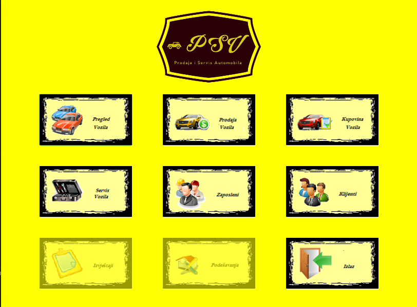
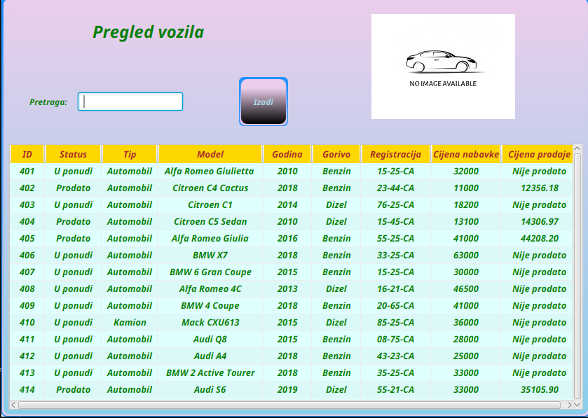
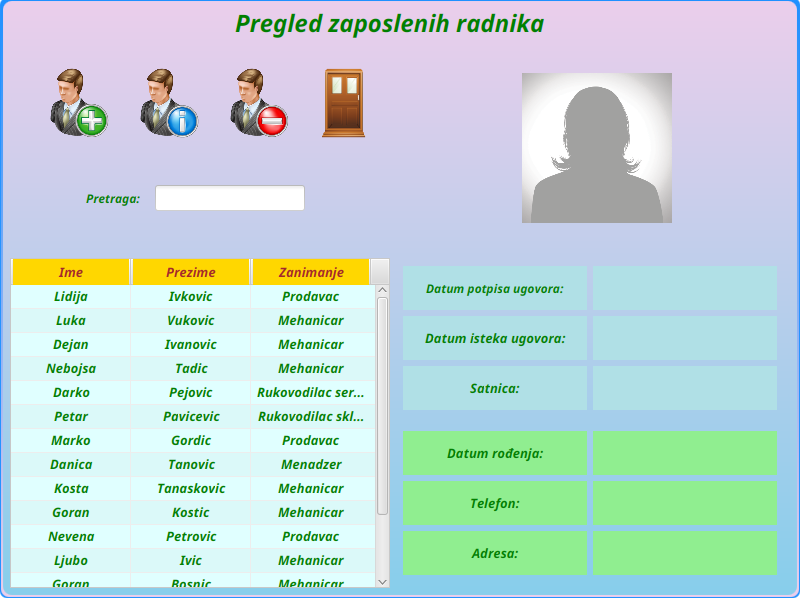

<br>
<br>
<div align="center">
  <h1>Vehicle Sales and Repair</h1> 
</div>
<br>

**PSV (Prodaja i Servis Vozila)** predstavlja specijalizovani programski sistem namijenjen poslovanju i zahtjevima auto kuća i salona, kao i centrima koji nude usluge servisiranja vozila. 

Aplikacija omogućava jednostavno i efikasno upravljanje nabavkom i distribucijom vozila, vođenje evidencije o ponudama, narudžbama i ugovorima sklopljenim u toku kupoprodaje vozila, radnim nalozima, terminima za servis i drugim dokumentima.

<div style="page-break-before: always;"></div>

<div align="center">
  &nbsp;
</div>

<div align="center">
  &nbsp;
  &nbsp;
</div>

---

## 📋 Specifikacija informacionih potreba

### 1. Upravljanje zaposlenima

Sistem omogućava kompletno vođenje računa o zaposlenim radnicima u kompaniji:
*   **Osnovni podaci:** Ime, prezime, datum rođenja, fotografija.
*   **Podaci o zaposlenju:** Datum sklapanja ugovora, funkcija (uloga), satnica i datum isteka ugovora.
*   **Kontakt podaci:** Adresa stanovanja, broj telefona i email.

**Klase zaposlenih unutar sistema:**
*   `Menadžer` – potpisuje ugovore o prodaji i kontroliše žiro račune kompanije.
*   `Rukovodilac servisa` – odobrava zahtjeve za servis i koordinira radom.
*   `Mehaničar` – izvršava radne naloge u određenoj smjeni na osnovu svojih kvalifikacija.
*   `Rukovodilac skladišta` – upravlja stanjem dijelova i materijala i vrši narudžbe.
*   `Prodavac` – realizuje prodaju vozila i ostvaruje premije na osnovu sklopljenih poslova.

---

### 2. Evidencija klijata

Sistem detaljno prati potencijalne i postojeće klijente. Za svakog klijenta se bilježe grad, adresa, email, više telefonskih brojeva (privatni/poslovni) i pripadajući žiro računi otvoreni kod banaka (sa JIB-om, nazivom i sjedištem banke).

Klijenti se dijele na **vrste** i **kategorije**:

*   **Vrste klijenata:**
    *   `Distributer vozila` (posjeduje svoj rejting od kojeg zavisi nabavka).
    *   `Kupac` (može biti evidentiran i kao potencijalni kupac u fazi pregovora).
    *   `Korisnik servisa` (klijent koji je podnio barem jedan zahtjev za servis).

*   **Kategorije klijenata:**
    *   `Individualno lice` – karakterišu ga ime, prezime i pol.
    *   `Kompanija` – karakterišu je naziv kompanije i zvanična internet stranica.

---

### 3. Evidencija i prodaja vozila

Matični podaci o vozilu obuhvataju: tip, proizvođača, model, vrstu goriva, boju, pređenu kilometražu, godinu proizvodnje, broj i datum registracije, fotografiju i broj šasije.

Sistem razlikuje dva osnovna stanja vozila:
1.  **Vozilo u vlasništvu** – Nalazi se na stanju auto kuće i prolazi kroz statuse:
    *   `Ponuda` – spremno za prodaju.
    *   `Obrada` – vezano za potencijalnog kupca (ako kupac odustane, status se vraća na *Ponuda*, ali podaci o klijentu ostaju u bazi).
    *   `Prodato` – uspješno realizovana prodaja.
    *   *Dodatna svojstva:* Podatak o tehničkoj podršci, garanciji, carini i broju garaže u kojoj je smješteno.
2.  **Prodato vozilo** – Transformisano vozilo u vlasništvu nakon postizanja dogovora sa kupcem.

#### Finansijski parametri prodaje:
*   **Podaci o prodaji:** Način plaćanja, osnovna cijena, period garancije, datum sljedeće uplate, status plaćanja i trenutno naplaćeni iznos.
*   **Plaćanje na rate (Kredit):** Otvara se kod odgovarajuće banke, definiše se broj rata i iznos pojedinačne rate.
*   **Polisa osiguranja:** Otvara se kod ovlaštenog osiguravajućeg društva (odobren iznos i period reklamacije).

#### Obračun konačne cijene vozila:
Cijena prodatog vozila se računa dinamički na osnovu sljedećih pravila:
*   Na osnovnu cijenu vozila dodaje se marža od **10%**.
*   Za plaćanje na rate, ukupna cijena se povećava za **1.5%**.
*   Za gotovinsko plaćanje, cijena se umanjuje za **3%**.
*   Za svaki dodatni dan reklamacije, cijena vozila se uvećava za **0.01%**.

---

### 4. Modul za servisiranje vozila

Korisnici servisa podnose zahtjev za servisiranje vozila (jedan zahtjev može obuhvatiti više vozila, npr. remont cjelokupnog voznog parka neke kompanije).

#### Servisna knjiga vozila
Svako vozilo ima svoju servisnu knjigu koja sadrži: ukupni broj obavljenih servisa, opis problema/kvarova, istoriju ranijih popravki, datum posljednjeg servisa i status. 
*   *Ograničenje:* Aktivni status u servisnoj knjizi sprečava da se vozilo doda u novi zahtjev sve dok je trenutni servis u toku.

#### Tok servisnog procesa:
1.  **Obrada zahtjeva:** Rukovodilac servisa prati slobodne termine, dostupnost mehaničara i vrstu kvara, te procjenjuje troškove i vrijeme popravke.
2.  **Izdavanje radnih naloga:** Za prihvaćeno vozilo izdaju se radni nalozi sa vrstom servisnog rada i terminom realizacije.
3.  **Realizacija:** Jedan ili više mehaničara izvršavaju naloge u skladu sa svojim smjenama i kvalifikacijama (zamjena ulja, servis klime, gume, diskovi, reparacija turbine itd.).
4.  **Skladište i materijali:** Radni nalozi povlače potrošne dijelove sa skladišta (naziv, cijena, tip, količina) koje kontroliše rukovodilac skladišta kroz sistemske otpremnice.

#### Formiranje cijene servisa i naplata:
Nakon realizacije, radni nalog se transformiše u **Uslugu**. 
*   Cijena pojedinačne usluge se obračunava na osnovu broja utrošenih sati, cijene dijelova i fiksnog koeficijenta servisnog rada koji je važio u trenutku kreiranja radnog naloga.
*   Moguće je istovremeno naplatiti više usluga kroz jednu naplatu (svaka naplata dobija jedinstveni broj, vrijednost popusta i ažurira status naplaćenih/nenaplaćenih stavki).
*   **Dodatne usluge:** Sistem podržava i obračun dodatnih usluga kao što su odvoz/dovoz vozila, zatečena količina goriva u rezervoaru ili iznajmljivanje zamjenskog vozila.

Kada se zatvore svi aktivni radni nalozi za vozilo, automatski se mijenja njegov status u servisnoj knjizi i ažurira datum posljednjeg servisa.

---

## 💻 Tehnologije i Alati

* **Jezik:** Java 17 (OpenJDK)
* **GUI Biblioteka:** JavaFX 17
* **Arhitekturalni koncepti:** Multithreading (`Thread`, `Runnable`), Sinhronizacija (`synchronized`, `Locks`), Java I/O i Serijalizacija.
* **Logovanje:** Integrisana `Logger` klasa za robusno upravljanje izuzecima u svim modulima.

---

## 🚀 Kako pokrenuti projekat lokalno

### Preduslovi
* Instaliran **Java 17 JDK**.
* Preuzet **JavaFX SDK 17**.
* Instaliran **MySQL Server** (verzija 8.0 ili novija).

### Podešavanje baze podataka
Prije pokretanja aplikacije, potrebno je kreirati i popuniti bazu podataka. Pozicionirajte se u folder sa SQL skriptama i izvršite ih u sljedećem redoslijedu:

1. `PSV_kreiranje_seme.sql`
2. `PSV_procedure _trigeri.sql`
3. `PSV_popunjavanje_baze.sql`

Nakon uvoza skripti, otvorite konfiguracioni fajl `ConnectionPool.properties` unutar projekta i prilagodite parametre `username` i `password` vašoj lokalnoj konfiguraciji MySQL servera.

### Konfiguracija VM argumenata u razvojnom okruženju (IDE)
Da bi JavaFX moduli bili ispravno učitani, unutar vašeg razvojnog okruženja (npr. IntelliJ IDEA, Eclipse ili VS Code) potrebno je u konfiguraciju pokretanja (Run Configuration / VM Options) dodati sljedeće VM argumente sa putanjom do vašeg lokalnog JavaFX SDK-a:

```text
--module-path /putanja/do/javafx-sdk-17/lib --add-modules javafx.controls,javafx.fxml
